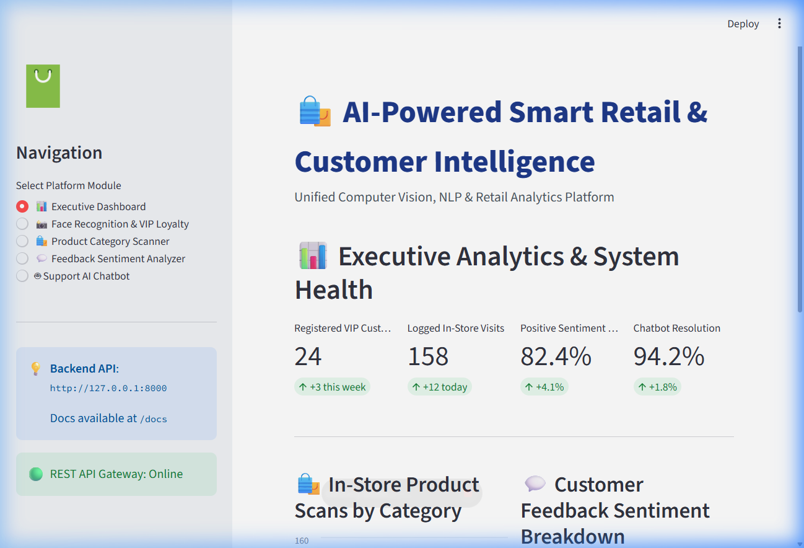
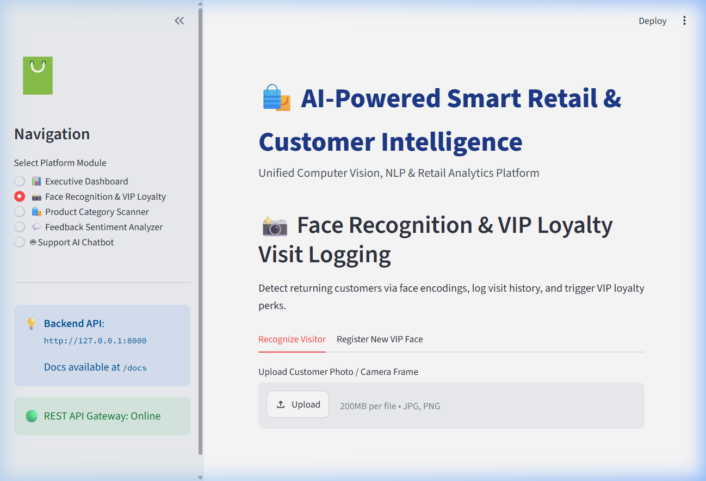
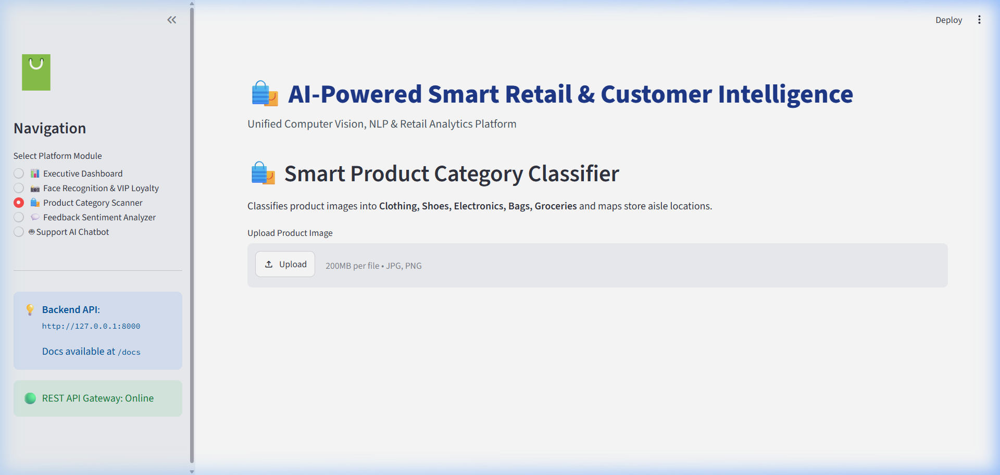
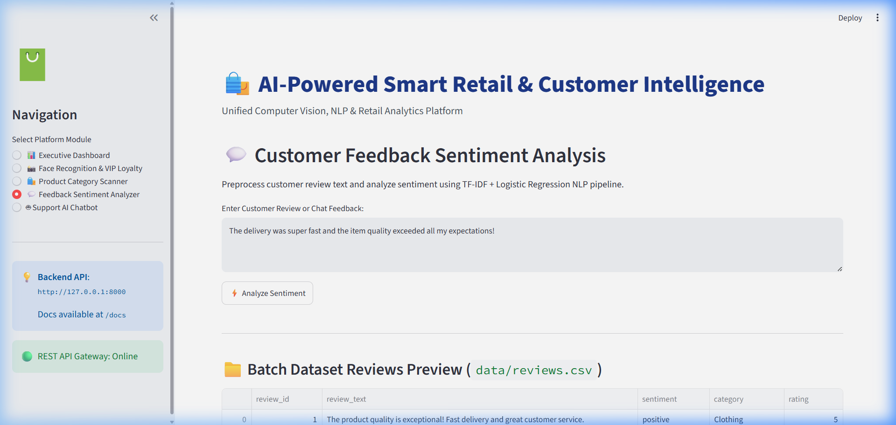
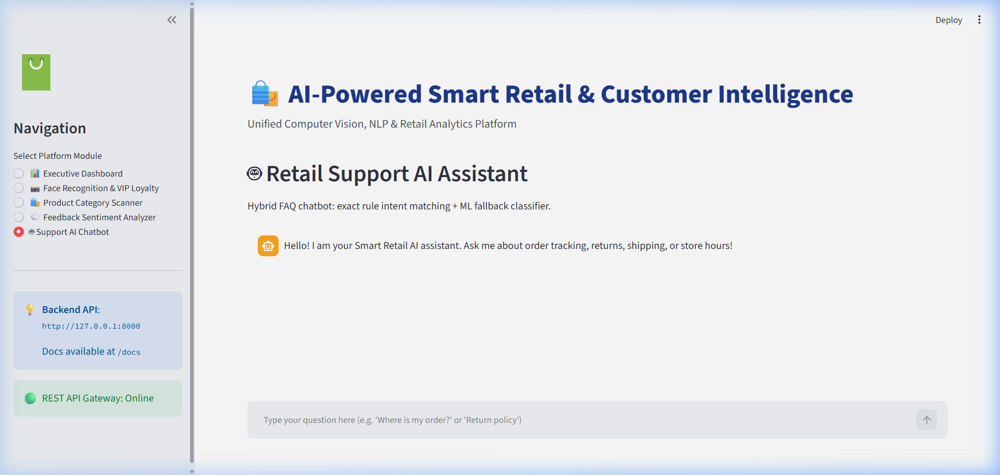
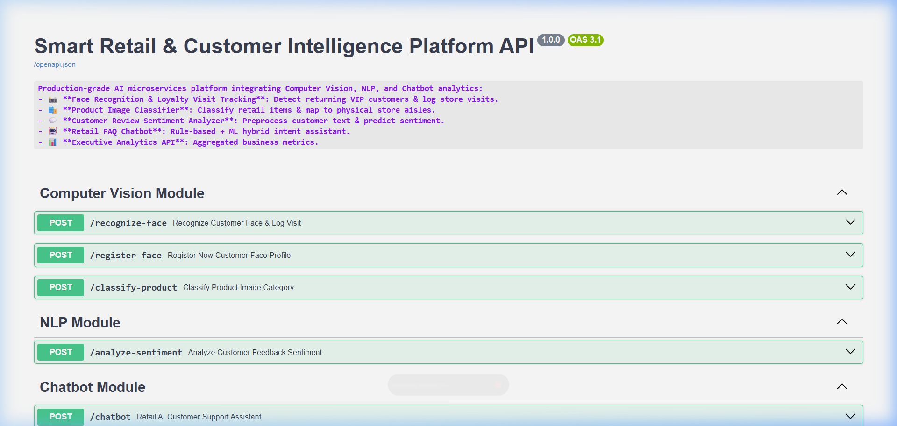

# 🛍️ MPOnline Smart Retail & Customer Intelligence Platform
> **Batch 11A — Student ID / Project Reference: IN26012771**

[](https://www.python.org/)
[](https://fastapi.tiangolo.com/)
[](https://streamlit.io/)
[](https://opencv.org/)
[](https://docs.pytest.org/)
[](https://www.docker.com/)

An end-to-end production-grade AI retail platform combining **Computer Vision** (face recognition loyalty visit tracking & product image category classification), **Natural Language Processing** (customer review sentiment analysis), **Support AI Assistant** (hybrid FAQ chatbot), and a **FastAPI REST Gateway** backed by an interactive **Streamlit Web Dashboard**.

---

## 📸 Interactive Web Dashboard & API Preview

### 📊 Executive Analytics Dashboard
Provides real-time retail intelligence metrics, in-store scan distributions, and sentiment trends.


---

### 📸 Face Recognition & VIP Loyalty Tracking
Detects returning VIP customers using facial feature encodings, logs visit history, and triggers personalized perks.


---

### 🛍️ Smart Product Category Scanner
Classifies product images into retail categories (Clothing, Shoes, Electronics, Bags, Groceries) and maps recommended store aisles.


---

### 💬 Customer Feedback Sentiment Analyzer
Preprocesses customer reviews (TF-IDF + Logistic Regression) to analyze customer satisfaction in real time.


---

### 🤖 Retail Support AI Assistant
Hybrid rule-based pattern matching + Naive Bayes ML intent classifier for customer support queries.


---

### 🌐 OpenAPI / Swagger REST API Gateway
Comprehensive REST endpoints with interactive Swagger UI and automatic Pydantic input validation.


---

## 🏗️ System Architecture

```text
                               +------------------------------------------+
                               |    Interactive Streamlit Web Dashboard   |
                               |      (http://localhost:8501)             |
                               +--------------------+---------------------+
                                                    | REST Calls
                                                    v
                               +--------------------+---------------------+
                               |          FastAPI REST API Gateway        |
                               |    (Swagger Docs at http://127.0.0.1:8000/docs)
                               +--+-----------------+------------------+--+
                                  |                 |                  |
               +------------------+                 |                  +------------------+
               |                                    v                                     |
               v                                +---+---+                                 v
   +-----------+-----------+                    |  NLP  |                    +------------+-----------+
   |    Computer Vision    |                    +---+---+                    |   FAQ Support Chatbot  |
   |        Module         |                        |                        |        Module          |
   +-----------+-----------+                        v                        +------------+-----------+
   | - Face Recognition    |            +-----------+-----------+            | - Pattern Rule Matcher |
   | - OpenCV Haar Cascade |            | Sentiment Analyzer    |            | - TF-IDF + Naive Bayes |
   | - Product Classifier  |            | - TF-IDF Vectorizer   |            | - FAQ Intent Generator |
   | - Store Aisle Mapping |            | - Logistic Regression |            +------------+-----------+
   +-----------+-----------+            +-----------+-----------+                         |
               |                                    |                                     |
               +------------------------------------+-------------------------------------+
                                                    |
                                                    v
                               +--------------------+---------------------+
                               |         Serialized Model Storage         |
                               | (product_classifier.pkl, face_db.pkl,   |
                               |  sentiment_model.pkl, chatbot_model.pkl) |
                               +------------------------------------------+
```

---

## 🌟 Key Features

1. **Facial Recognition VIP Visitor Logging**:
   - OpenCV Haar Cascade face detection + 128D mathematical embedding calculation.
   - Automatic visit counter increment & loyalty status tracking.

2. **Product Image Classifier & Store Aisle Mapper**:
   - Multi-category image feature extractor (color histogram + Canny edge descriptors).
   - Automated mapping to physical store aisles (e.g. *Aisle 1 - Tech*, *Aisle 3 - Apparel*).

3. **NLP Customer Review Sentiment Analyzer**:
   - Regex text cleaning, custom stopword removal, TF-IDF vectorization.
   - Logistic Regression classifier returning sentiment class and confidence probability score.

4. **Hybrid FAQ Support Chatbot**:
   - Rule-based regex pattern matcher combined with Multinomial Naive Bayes fallback intent classifier.
   - Over 25+ retail intents supported (orders, returns, shipping, store hours, rewards).

5. **RESTful API Gateway**:
   - Clean, modular FastAPI application architecture ([app/main.py](file:///d:/Smart%20Retail%20&%20Customer%20Intelligence%20Platform/app/main.py)).
   - Strict request/response schemas with Pydantic v2.

---

## 🛠️ Step-by-Step Installation & Setup

### Prerequisites
* Python 3.10 or 3.11 installed
* Git installed

### 1. Clone the Repository
```bash
git clone https://github.com/Shivanand24/MPOnline-Smart-Retail-Customer-Intelligence-Platform-Batch-11A-IN26012771.git
cd MPOnline-Smart-Retail-Customer-Intelligence-Platform-Batch-11A-IN26012771
```

### 2. Install Python Dependencies
```bash
pip install -r requirements.txt
```

### 3. Train & Serialize AI Models
Train the Product Classifier, Face Database, Sentiment Model, and Chatbot Intent Classifier:
```bash
python scripts/train_models.py
```

### 4. Run Automated Test Suite
Verify that all 8 API endpoints and ML services pass unit and integration tests:
```bash
python -m pytest tests/test_endpoints.py
```

### 5. Start the FastAPI Backend Gateway
Launch the REST API server:
```bash
python -m uvicorn app.main:app --reload --host 127.0.0.1 --port 8000
```
* 🌐 **Interactive Swagger Docs**: [http://127.0.0.1:8000/docs](http://127.0.0.1:8000/docs)
* 🌐 **ReDoc API Documentation**: [http://127.0.0.1:8000/redoc](http://127.0.0.1:8000/redoc)

### 6. Launch the Streamlit Web Dashboard
In a **new terminal window**, run:
```bash
python -m streamlit run dashboard.py
```
* 🚀 **Interactive Dashboard App**: Automatically opens at [http://localhost:8501](http://localhost:8501).

---

## 🐳 Docker Deployment

To run the entire platform in isolated Docker containers:

```bash
docker-compose up --build -d
```

This starts:
- **API Container**: Port `8000`
- **Dashboard Container**: Port `8501`

---

## 📂 Project Structure

```text
.
├── app/
│   ├── main.py                  # FastAPI application entrypoint & router setup
│   ├── schemas.py               # Pydantic request/response schemas
│   ├── routers/                 # Modular API endpoints (vision, nlp, chatbot)
│   ├── models/                  # Serialized .pkl machine learning models
│   └── services/                # Business logic, computer vision & NLP processing
├── data/
│   ├── reviews.csv              # Customer review dataset
│   └── intents.json             # Retail FAQ intent training dataset
├── docs/
│   └── assets/                  # Dashboard screenshots and visual diagrams
├── notebooks/                   # Jupyter notebooks for model experiments
├── scripts/
│   └── train_models.py          # Model training and serialization script
├── tests/
│   └── test_endpoints.py        # Pytest automated test suite
├── .github/workflows/
│   └── deploy.yml               # GitHub Actions CI/CD pipeline
├── dashboard.py                 # Streamlit web application
├── Dockerfile                   # Production Docker image build instructions
├── docker-compose.yml           # Docker Compose multi-container setup
├── requirements.txt             # Python dependencies
└── README.md                    # Project documentation
```

---

## ⚖️ Ethics, Privacy & Bias Mitigation

1. **Facial Recognition Consent**: In production retail environments, facial recognition must operate on an opt-in basis.
2. **Data Privacy**: Customer face representations are saved as anonymized 128D mathematical encodings rather than raw customer images.
3. **Model Transparency**: Sentiment and intent classification confidence scores are exposed transparently to operators.

---

## 📄 License
This project is open-source and available under the [MIT License](LICENSE).
